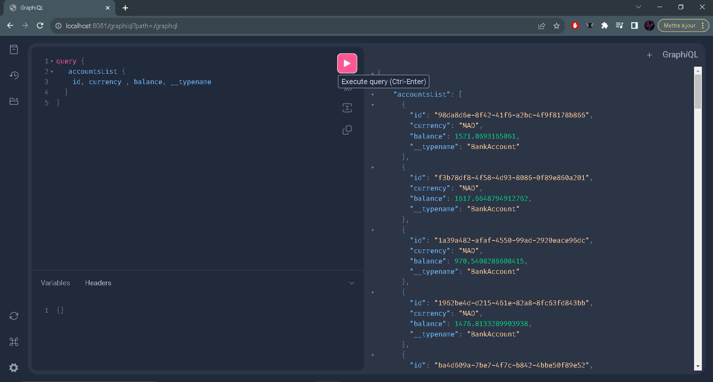
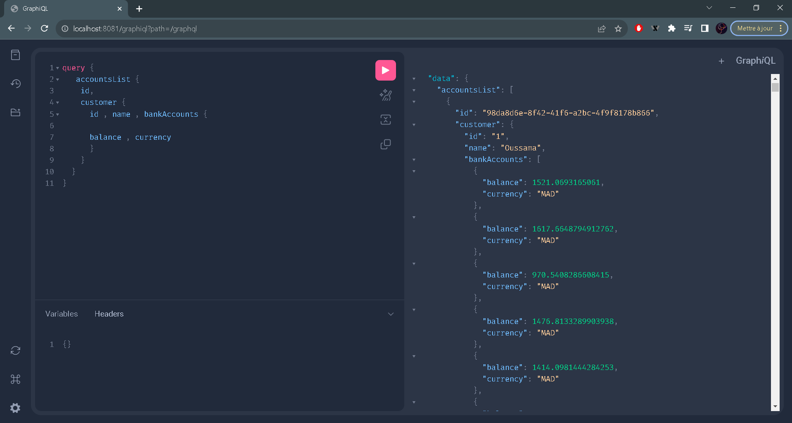
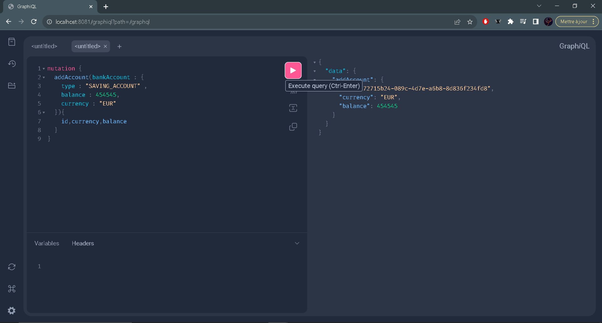
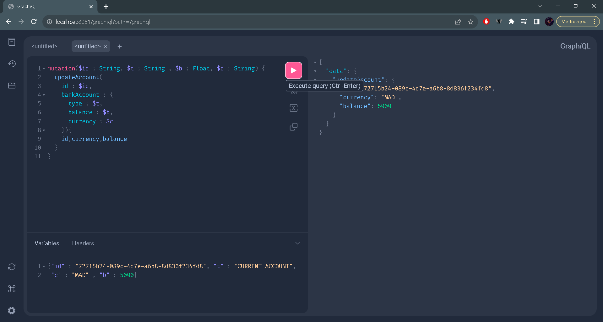
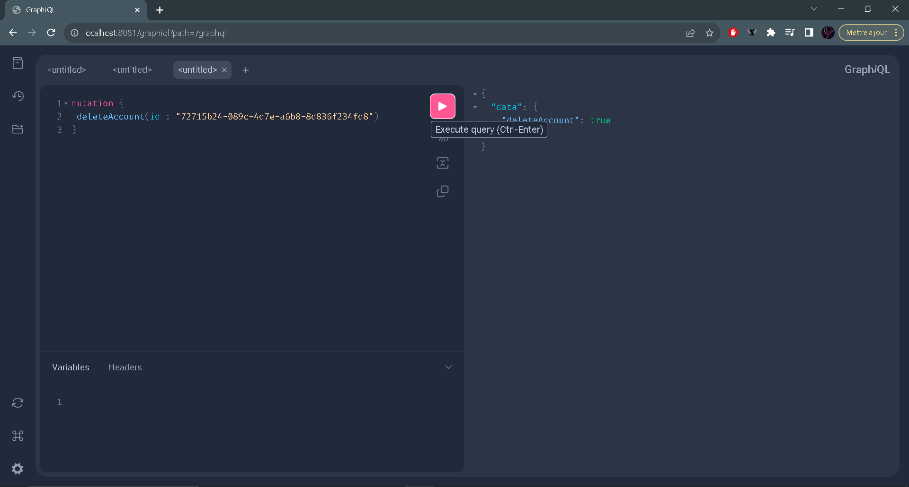
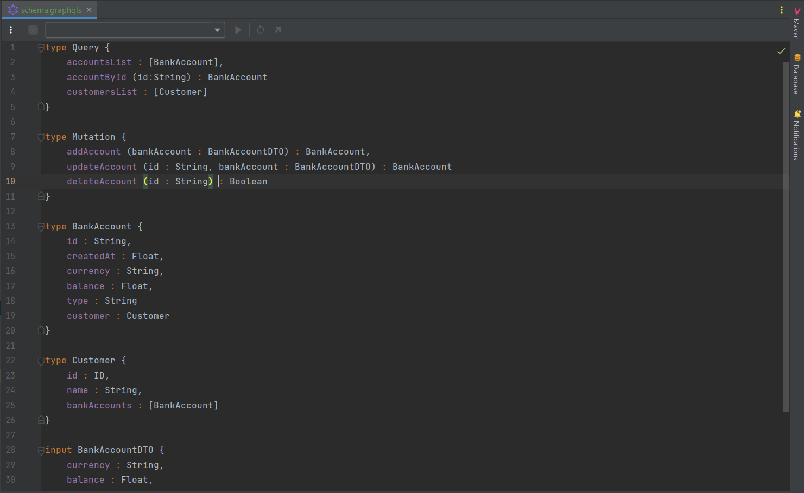
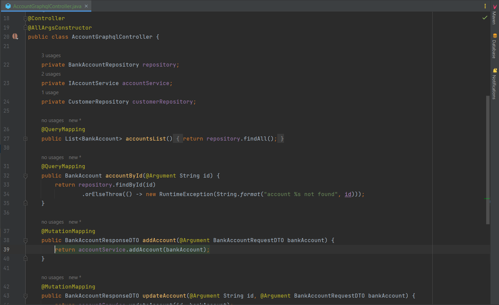

<h1><center>Bank Account</center></h1>

<hr>

<br>
<center>Microservice qui permet des gérer des comptes bancaires :</center>
<br>
<hr>

<br>
<br>

<center>les tests du WebService GraphQL </center>
<br>
<hr>

### 1. pour "Query"

le premier test pour recuperer la liste des comptes bancaires



le deuxieme test pour recuperer les informations du client avec ses comptes bancaires




### 2. pour "Mutation"

le premier test pour la creation du compte





le deuxieme test pour la modification du compte





le troisieme test pour la suppression du compte




<hr>

<br>

Pour utiliser GraphQL on doit premierement ajouter la dependance

```markdown
<dependency>
<groupId>org.springframework.boot</groupId>
<artifactId>spring-boot-starter-graphql</artifactId>
</dependency>
```
Tout d'abord comme le webservice REST qui utilise un interface comme Swagger, GraphQL a besoin d'un interface
C'est pour cela on doit le creer comme le suivant :





le schema represente query, mutation et les models qu'on a utiliser "BankAccount", "Customer" pour qu'il soit reactif avec le controlleur.

Query est utilisé pour les requêtes de type GET (select ? from ?)

Mutation est utilisé pour les requêtes de type (POST, PUT, DELETE)

<hr>

<h4><center>REMARQUE</center></h4>

```markdown
Un point clé d’une API GraphQL est que la donnée est exposée via un point d’entrée unique (accessible via une requête POST),
et c’est au client, dans sa requête, de définir les données qu’il souhaite recevoir en retour.
```
<hr>
Puis on a utiliser un input pour les endpoints qui utilise des arguments, si on veut par exemple creer un compte bancaire qui utilise BankAccountDTO dans son corps
on doit utiliser input au niveau d'interface pour definir les attributs que doit le corps contenir

<br>





